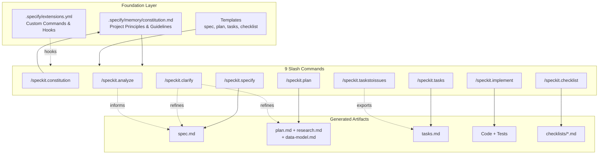

# @oakoliver/specify-cli

Spec-Driven Development CLI for AI coding agents. Zero runtime dependencies, multi-runtime (Node.js 18+, Bun, Deno).

Ported from [github/spec-kit](https://github.com/github/spec-kit) (Python) to TypeScript.

## Install

```bash
npm install -g @oakoliver/specify-cli
# or
bun install -g @oakoliver/specify-cli
```

## Quick Start

```bash
# Initialize a new project with interactive agent selection
specify init my-project

# Or specify the agent directly
specify init my-project --ai opencode

# Initialize in current directory
specify init . --ai claude --here

# Check project structure
specify check
```

## The Spec-Driven Development Workflow

Spec-Driven Development (SDD) is a methodology where every feature starts as a specification before any code is written. This ensures clarity, alignment, and systematic implementation — especially powerful when working with AI coding agents.

### Architecture Overview



### Complete Workflow Sequence

```mermaid
sequenceDiagram
    autonumber
    participant Dev as Developer
    participant CLI as specify CLI
    participant Agent as AI Agent
    participant Const as Constitution
    participant Ext as Extensions
    participant FS as File System

    Note over Dev,FS: PHASE 0: Project Setup

    Dev->>CLI: specify init my-project --ai claude
    CLI->>FS: Create .specify/ structure
    CLI->>FS: Copy templates (spec, plan, tasks, checklist)
    CLI->>FS: Create constitution-template.md
    CLI->>FS: Install bash scripts
    CLI->>FS: Register agent commands (.claude/commands/)
    CLI-->>Dev: Project initialized

    Note over Dev,FS: PHASE 1: Constitution (Optional but Recommended)

    Dev->>Agent: /speckit.constitution "Define project principles"
    Agent->>FS: Load constitution-template.md
    Agent->>Dev: Collect principles interactively
    Agent->>FS: Write .specify/memory/constitution.md
    Agent->>FS: Propagate to dependent templates
    Agent-->>Dev: Constitution v1.0.0 ratified

    Note over Dev,FS: PHASE 2: Specification

    Dev->>Agent: /speckit.specify "Add user authentication with OAuth"
    
    Note right of Ext: HOOK: before_specify
    Agent->>Ext: Check .specify/extensions.yml
    Ext-->>Agent: Run pre-hooks (if any)

    Agent->>FS: Run create-new-feature.sh --json
    FS-->>Agent: {branch: "001-user-auth", spec_file: "..."}
    Agent->>FS: Load spec-template.md
    Agent->>Const: Load constitution principles
    Agent->>Agent: Generate spec from description
    Agent->>FS: Write specs/001-user-auth/spec.md
    Agent->>FS: Create checklists/requirements.md
    Agent->>Agent: Validate spec quality
    
    alt Has [NEEDS CLARIFICATION]
        Agent->>Dev: Present clarification questions (max 3)
        Dev->>Agent: Provide answers
        Agent->>FS: Update spec with answers
    end

    Note right of Ext: HOOK: after_specify
    Agent->>Ext: Check .specify/extensions.yml
    Ext-->>Agent: Run post-hooks (if any)

    Agent-->>Dev: Spec complete, ready for /speckit.plan

    Note over Dev,FS: PHASE 3: Planning

    Dev->>Agent: /speckit.plan

    Note right of Ext: HOOK: before_plan
    Agent->>Ext: Check .specify/extensions.yml
    Ext-->>Agent: Run pre-hooks (if any)

    Agent->>FS: Run setup-plan.sh --json
    Agent->>FS: Load spec.md
    Agent->>Const: Load constitution for compliance check

    Note over Agent: Phase 0: Research
    Agent->>Agent: Extract unknowns from spec
    Agent->>Agent: Research technologies & patterns
    Agent->>FS: Write research.md

    Note over Agent: Phase 1: Design
    Agent->>FS: Write data-model.md
    Agent->>FS: Write contracts/ (if APIs)
    Agent->>FS: Write quickstart.md
    Agent->>FS: Run update-agent-context.sh
    Agent->>Const: Re-validate against constitution
    Agent->>FS: Write plan.md

    Note right of Ext: HOOK: after_plan
    Agent->>Ext: Check .specify/extensions.yml
    Ext-->>Agent: Run post-hooks (if any)

    Agent-->>Dev: Plan complete, ready for /speckit.tasks

    Note over Dev,FS: PHASE 4: Task Breakdown

    Dev->>Agent: /speckit.tasks
    Agent->>FS: Load plan.md, spec.md
    Agent->>Agent: Break plan into atomic tasks
    Agent->>Agent: Identify dependencies & parallel work [P]
    Agent->>FS: Write tasks.md with phases
    Agent-->>Dev: Tasks ready for /speckit.implement

    Note over Dev,FS: PHASE 5: Implementation

    Dev->>Agent: /speckit.implement

    Note right of Ext: HOOK: before_implement
    Agent->>Ext: Check .specify/extensions.yml
    Ext-->>Agent: Run pre-hooks (if any)

    Agent->>FS: Load tasks.md, plan.md, data-model.md
    Agent->>FS: Check checklists status

    alt Incomplete Checklists
        Agent->>Dev: "Checklists incomplete. Proceed? (yes/no)"
        Dev->>Agent: Decision
    end

    Agent->>FS: Setup project (ignore files, structure)

    loop For each task phase
        loop For each task
            Agent->>Agent: Execute task (TDD: tests first)
            Agent->>FS: Write code & tests
            Agent->>FS: Mark task [X] in tasks.md
        end
        Agent->>Agent: Validate phase completion
    end

    Note right of Ext: HOOK: after_implement
    Agent->>Ext: Check .specify/extensions.yml
    Ext-->>Agent: Run post-hooks (if any)

    Agent-->>Dev: Implementation complete

    Note over Dev,FS: SUPPORTING COMMANDS (Anytime)

    Dev->>Agent: /speckit.clarify "What about edge case X?"
    Agent->>FS: Load current spec/plan
    Agent->>Dev: Ask clarifying questions
    Dev->>Agent: Provide answers
    Agent->>FS: Update spec/plan with clarifications

    Dev->>Agent: /speckit.analyze "How does auth work currently?"
    Agent->>FS: Search codebase
    Agent-->>Dev: Analysis report with patterns

    Dev->>Agent: /speckit.checklist "security"
    Agent->>FS: Load checklist-template.md
    Agent->>FS: Write checklists/security.md

    Dev->>Agent: /speckit.taskstoissues
    Agent->>FS: Load tasks.md
    Agent->>Agent: Format as GitHub issues
    Agent-->>Dev: Ready to create issues via gh CLI
```



### Extension Hooks

Extensions can inject custom behavior at key points in the workflow:

| Hook Point | When It Runs | Use Cases |
|------------|--------------|-----------|
| `before_specify` | Before spec generation | Pre-validation, context gathering |
| `after_specify` | After spec is written | Auto-review, notifications |
| `before_plan` | Before planning starts | Load external research, check constraints |
| `after_plan` | After plan is complete | Architecture review, cost estimation |
| `before_implement` | Before coding starts | Environment setup, dependency checks |
| `after_implement` | After implementation | Auto-testing, deployment triggers |

**[See full Extension Hooks documentation](docs/EXTENSION_HOOKS.md)** for:
- Lifecycle state diagrams
- Hook execution flow
- Real-world extension examples (security scanner, Jira sync, ADR generator, cost estimator, compliance checker)
- How to create your own extensions

Quick example in `.specify/extensions.yml`:

```yaml
hooks:
  after_specify:
    - extension: security-review
      command: speckit.security-scan
      description: Run security analysis on spec
      optional: false  # Mandatory - blocks if fails
  before_implement:
    - extension: deps-check
      command: speckit.check-deps
      description: Verify all dependencies available
      optional: true   # Optional - user decides to run
```

### The Flow (Simplified)

```
┌─────────────────────────────────────────────────────────────────────────────┐
│                        SPEC-DRIVEN DEVELOPMENT FLOW                         │
└─────────────────────────────────────────────────────────────────────────────┘

  ┌──────────┐     ┌──────────┐     ┌──────────┐     ┌──────────┐
  │  SPECIFY │────▶│   PLAN   │────▶│  TASKS   │────▶│IMPLEMENT │
  └──────────┘     └──────────┘     └──────────┘     └──────────┘
       │                │                │                │
       ▼                ▼                ▼                ▼
  ┌──────────┐     ┌──────────┐     ┌──────────┐     ┌──────────┐
  │ spec.md  │     │ plan.md  │     │ tasks.md │     │   Code   │
  │          │     │research.md│    │          │     │  Tests   │
  │          │     │data-model│     │          │     │   PR     │
  └──────────┘     └──────────┘     └──────────┘     └──────────┘
       │                │                │                │
       └────────────────┴────────────────┴────────────────┘
                                │
         ┌──────────────────────┼──────────────────────┐
         │                      │                      │
    ┌────┴─────┐         ┌──────┴──────┐        ┌──────┴──────┐
    │ CLARIFY  │         │  CHECKLIST  │        │   ANALYZE   │
    │(anytime) │         │  (quality)  │        │ (codebase)  │
    └──────────┘         └─────────────┘        └─────────────┘
```

### Step-by-Step Workflow

#### 1. Create a Feature Branch

```bash
# Using the provided script
.specify/scripts/bash/create-new-feature.sh "user-authentication"

# This creates:
# - Branch: 001-user-authentication
# - Directory: specs/001-user-authentication/
# - Files: spec.md, checklists/requirements.md
```

#### 2. Write the Specification (`/speckit.specify`)

In your AI agent, run:

```
/speckit.specify Add user authentication with email/password login, 
OAuth support for Google and GitHub, and JWT-based session management.
```

This creates a structured `spec.md` with:
- Feature description
- User stories with acceptance criteria
- Functional requirements
- Non-functional requirements
- Out of scope items

**Example output:**

```markdown
# Feature: User Authentication

## Overview
Implement a complete user authentication system...

## User Stories

### US-001: Email/Password Registration
As a new user, I want to register with my email and password...

**Acceptance Criteria:**
- [ ] Email validation with confirmation
- [ ] Password strength requirements enforced
- [ ] Duplicate email detection
```

#### 3. Create the Plan (`/speckit.plan`)

```
/speckit.plan
```

This analyzes the spec and creates:
- `plan.md` — Implementation strategy with phases
- `research.md` — Technical research and decisions
- `data-model.md` — Database schema if applicable
- `quickstart.md` — Getting started guide

**Example plan.md:**

```markdown
# Implementation Plan: User Authentication

## Phase 1: Core Infrastructure (2 days)
- Set up authentication middleware
- Create user database schema
- Implement password hashing with bcrypt

## Phase 2: Email/Password Flow (3 days)
- Registration endpoint
- Login endpoint
- Email verification...
```

#### 4. Break Down Tasks (`/speckit.tasks`)

```
/speckit.tasks
```

Generates `tasks.md` with atomic, implementable tasks:

```markdown
# Tasks: User Authentication

## Phase 1: Core Infrastructure

### Task 1.1: Create User Model
**Estimate:** 1 hour
**Dependencies:** None

**Subtasks:**
- [ ] Define User interface in `src/types/user.ts`
- [ ] Create Prisma schema for User table
- [ ] Run migration
- [ ] Write unit tests for model validation

**Acceptance Criteria:**
- User model includes: id, email, passwordHash, createdAt, updatedAt
- Email field has unique constraint
- All tests pass
```

#### 5. Implement (`/speckit.implement`)

```
/speckit.implement Task 1.1
```

The AI agent:
1. Reads the task requirements
2. Implements the code
3. Writes tests
4. Marks subtasks complete
5. Suggests the next task

### Supporting Commands

| Command | When to Use |
|---------|-------------|
| `/speckit.clarify` | When requirements are ambiguous |
| `/speckit.analyze` | To understand existing codebase patterns |
| `/speckit.checklist` | To create quality checklists |
| `/speckit.constitution` | To define project principles |
| `/speckit.taskstoissues` | To export tasks as GitHub issues |

## Complete Examples

### Example 1: New Feature from Scratch

```bash
# 1. Create the project
specify init my-saas --ai claude

# 2. Create feature branch
cd my-saas
.specify/scripts/bash/create-new-feature.sh "stripe-integration"

# 3. In Claude, write the spec
/speckit.specify Integrate Stripe for subscription billing. 
Support monthly and annual plans, usage-based pricing, 
and webhook handling for payment events.

# 4. Create implementation plan
/speckit.plan

# 5. Generate tasks
/speckit.tasks

# 6. Implement task by task
/speckit.implement Task 1.1
/speckit.implement Task 1.2
# ... continue until done

# 7. Create PR
gh pr create --title "feat: Stripe subscription billing"
```

### Example 2: Clarifying Requirements

When you hit ambiguity during implementation:

```
/speckit.clarify The spec mentions "usage-based pricing" but doesn't 
specify how usage is measured. Should we track API calls, storage, 
or compute time? What are the pricing tiers?
```

The AI will:
1. Ask clarifying questions
2. Update the spec with your answers
3. Regenerate affected tasks if needed

### Example 3: Working with Existing Code

```
/speckit.analyze Find all authentication-related code in this codebase. 
How are users currently authenticated? What patterns should we follow?
```

Output includes:
- File locations
- Current patterns
- Recommendations for consistency

### Example 4: Quality Checklist

```
/speckit.checklist Create a security checklist for the authentication feature
```

Creates `checklists/security.md`:

```markdown
# Security Checklist: Authentication

## Password Security
- [ ] Passwords hashed with bcrypt (cost factor ≥ 12)
- [ ] No password stored in logs
- [ ] Password reset tokens expire after 1 hour

## Session Security
- [ ] JWT tokens have reasonable expiry
- [ ] Refresh token rotation implemented
- [ ] Sessions invalidated on password change
```

## Supported AI Agents

23 AI coding agents supported:

| Agent | Command Directory | Format |
|-------|------------------|--------|
| claude | `.claude/commands/` | Markdown |
| copilot | `.github/agents/` + `.github/prompts/` | Markdown |
| gemini | `.gemini/commands/` | TOML |
| opencode | `.opencode/command/` | Markdown |
| cursor | `.cursor/commands/` | Markdown |
| codex | `.agents/skills/` | SKILL.md |
| windsurf | `.windsurf/workflows/` | Markdown |
| tabnine | `.tabnine/agent/commands/` | TOML |
| kimi | `.kimi/skills/` | SKILL.md |
| qwen | `.qwen/commands/` | Markdown |
| junie | `.junie/commands/` | Markdown |
| roo | `.roo/commands/` | Markdown |
| amp | `.agents/commands/` | Markdown |
| trae | `.trae/rules/` | Markdown |
| *and more...* | | |

## CLI Reference

### `specify init`

```bash
specify init <project-name> [options]

Arguments:
  project-name          Project directory name (use "." for current dir)

Options:
  --ai <agent>          AI agent to configure (default: interactive picker)
  --here                Initialize in current directory (requires ".")
  --force               Overwrite existing files
  --no-git              Skip git repository initialization
  --script <sh|ps>      Shell script type (default: sh)
  --branch-numbering    "sequential" or "timestamp" (default: sequential)
  --ai-skills           Generate SKILL.md files for skill-based agents
  --ai-commands-dir     Custom commands directory (for generic agent)
  --offline             Use bundled assets only (no network)
  --help                Show help
  --version             Show version

Examples:
  specify init my-app
  specify init my-app --ai opencode
  specify init . --ai claude --here --force
  specify init my-app --ai codex --ai-skills
  specify init my-app --script ps --branch-numbering timestamp
```

### `specify check`

```bash
specify check [options]

Options:
  --fix                 Auto-fix missing directories and files

Examples:
  specify check
  specify check --fix
```

## Project Structure

```
my-project/
├── .specify/
│   ├── init-options.json        # Saved configuration
│   ├── memory/
│   │   └── constitution.md      # Project principles & guidelines
│   ├── templates/
│   │   ├── spec-template.md     # Specification template
│   │   ├── plan-template.md     # Plan template
│   │   ├── tasks-template.md    # Tasks template
│   │   └── ...
│   ├── scripts/
│   │   └── bash/
│   │       ├── create-new-feature.sh
│   │       ├── setup-plan.sh
│   │       └── ...
│   ├── extensions/              # Installed extensions
│   └── presets/                 # Installed presets
├── .<agent>/                    # Agent-specific config
│   └── commands/                # Installed slash commands
│       ├── speckit.specify.md
│       ├── speckit.plan.md
│       └── ...
└── specs/                       # Feature specifications
    └── 001-feature-name/
        ├── spec.md
        ├── plan.md
        ├── tasks.md
        └── checklists/
            └── requirements.md
```

## Extensions & Presets

Extend spec-kit with custom commands and templates:

```bash
# Extensions add new commands
specify extension add <extension-name>
specify extension list
specify extension remove <extension-id>

# Presets customize templates
specify preset add <preset-name>
specify preset list
specify preset remove <preset-id>
```

## Programmatic API

Use spec-kit in your own tools:

```typescript
import { 
  init, 
  check, 
  AGENT_CONFIGS, 
  SUPPORTED_AGENTS,
  registerCommands,
  ExtensionManager,
  PresetResolver
} from '@oakoliver/specify-cli';

// Initialize a project programmatically
await init({
  projectName: 'my-project',
  ai: 'opencode',
  script: 'sh',
  branchNumbering: 'sequential',
  noGit: false,
});

// Check project structure
const result = await check({ fix: false });
console.log(result.overall); // 'valid' | 'fixable' | 'invalid'

// Get agent configuration
const config = AGENT_CONFIGS['claude'];
console.log(config.dir);    // '.claude/commands'
console.log(config.format); // 'markdown'

// List all supported agents
console.log(SUPPORTED_AGENTS); // ['claude', 'copilot', 'gemini', ...]
```

## Why Spec-Driven Development?

1. **Clarity before code** — Writing the spec first forces you to think through requirements
2. **AI alignment** — Specs give AI agents clear context and acceptance criteria
3. **Incremental delivery** — Tasks are atomic and independently testable
4. **Documentation as artifact** — Specs, plans, and tasks serve as living documentation
5. **Quality gates** — Checklists ensure nothing is missed

## Attribution

This is a TypeScript port of [github/spec-kit](https://github.com/github/spec-kit), originally written in Python by GitHub. Licensed under MIT.

## License

MIT
