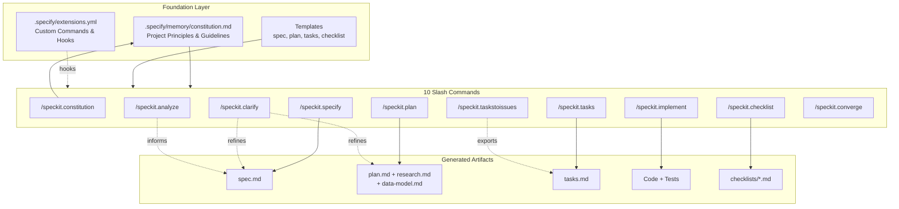

# @oakoliver/specify-cli

Spec-Driven Development CLI for AI coding agents. Zero runtime dependencies, multi-runtime (Node.js 18+, Bun, Deno).

Ported from [github/spec-kit](https://github.com/github/spec-kit) (Python) to TypeScript, at **1:1 parity with spec-kit v1.0.12** (run `specify version` to see the parity line).

> **v2.0.0 is a breaking release**, mirroring upstream's 1.0 line: the legacy `--ai`, `--ai-commands-dir`, `--ai-skills` and `--no-git` init flags are gone (use `--integration` / `--integration-options`; git is now the opt-in `git` extension), the roo/windsurf/iflow agents were retired upstream, and extensions/presets use `extension.yml` / `preset.yml` manifests.

## Install

```bash
npm install -g @oakoliver/specify-cli
# or
bun install -g @oakoliver/specify-cli
```

## Quick Start

```bash
# Initialize a new project with interactive integration selection
specify init my-project

# Or pick the integration directly
specify init my-project --integration opencode

# Initialize in the current directory, scripted (no prompts)
specify init --here --force --non-interactive --integration claude

# Add the opt-in git extension and a preset at init time
specify init my-project --integration claude --extension git --preset lean

# Check installed tools / project health
specify check
specify integration status
```

## The Spec-Driven Development Workflow

Spec-Driven Development (SDD) is a methodology where every feature starts as a specification before any code is written. This ensures clarity, alignment, and systematic implementation — especially powerful when working with AI coding agents.

### Architecture Overview


```mermaid
flowchart TB
    subgraph Foundation["Foundation Layer"]
        CONST[".specify/memory/constitution.md<br/>Project Principles & Guidelines"]
        TEMPLATES["Templates<br/>spec, plan, tasks, checklist"]
        EXTENSIONS[".specify/extensions.yml<br/>Custom Commands & Hooks"]
    end

    subgraph Commands["10 Slash Commands"]
        direction LR
        CONSTITUTION["/speckit.constitution"]
        SPECIFY["/speckit.specify"]
        PLAN["/speckit.plan"]
        TASKS["/speckit.tasks"]
        IMPLEMENT["/speckit.implement"]
        CLARIFY["/speckit.clarify"]
        ANALYZE["/speckit.analyze"]
        CHECKLIST["/speckit.checklist"]
        ISSUES["/speckit.taskstoissues"]
        CONVERGE["/speckit.converge"]
    end

    subgraph Artifacts["Generated Artifacts"]
        SPEC["spec.md"]
        PLANMD["plan.md + research.md<br/>+ data-model.md"]
        TASKSMD["tasks.md"]
        CODE["Code + Tests"]
        CHECKS["checklists/*.md"]
    end

    CONST --> Commands
    TEMPLATES --> Commands
    EXTENSIONS -.->|hooks| Commands

    CONSTITUTION --> CONST
    SPECIFY --> SPEC
    PLAN --> PLANMD
    TASKS --> TASKSMD
    IMPLEMENT --> CODE
    CHECKLIST --> CHECKS

    CLARIFY -.->|refines| SPEC
    CLARIFY -.->|refines| PLANMD
    ANALYZE -.->|informs| SPEC
    ISSUES -.->|exports| TASKSMD
```

### Complete Workflow Sequence


```mermaid
sequenceDiagram
    autonumber
    participant Dev as Developer
    participant CLI as specify CLI
    participant Agent as AI Agent
    participant Const as Constitution
    participant Ext as Extensions
    participant FS as File System

    Note over Dev,FS: PHASE 0: Project Setup

    Dev->>CLI: specify init my-project --integration claude
    CLI->>FS: Create .specify/ structure
    CLI->>FS: Copy templates (spec, plan, tasks, checklist)
    CLI->>FS: Create constitution-template.md
    CLI->>FS: Install bash scripts
    CLI->>FS: Register agent commands (.claude/commands/)
    CLI-->>Dev: Project initialized

    Note over Dev,FS: PHASE 1: Constitution (Optional but Recommended)

    Dev->>Agent: /speckit.constitution "Define project principles"
    Agent->>FS: Load constitution-template.md
    Agent->>Dev: Collect principles interactively
    Agent->>FS: Write .specify/memory/constitution.md
    Agent->>FS: Propagate to dependent templates
    Agent-->>Dev: Constitution v1.0.0 ratified

    Note over Dev,FS: PHASE 2: Specification

    Dev->>Agent: /speckit.specify "Add user authentication with OAuth"
    
    Note right of Ext: HOOK: before_specify
    Agent->>Ext: Check .specify/extensions.yml
    Ext-->>Agent: Run pre-hooks (if any)

    Agent->>FS: Run create-new-feature.sh --json
    FS-->>Agent: {branch: "001-user-auth", spec_file: "..."}
    Agent->>FS: Load spec-template.md
    Agent->>Const: Load constitution principles
    Agent->>Agent: Generate spec from description
    Agent->>FS: Write specs/001-user-auth/spec.md
    Agent->>FS: Create checklists/requirements.md
    Agent->>Agent: Validate spec quality
    
    alt Has [NEEDS CLARIFICATION]
        Agent->>Dev: Present clarification questions (max 3)
        Dev->>Agent: Provide answers
        Agent->>FS: Update spec with answers
    end

    Note right of Ext: HOOK: after_specify
    Agent->>Ext: Check .specify/extensions.yml
    Ext-->>Agent: Run post-hooks (if any)

    Agent-->>Dev: Spec complete, ready for /speckit.plan

    Note over Dev,FS: PHASE 3: Planning

    Dev->>Agent: /speckit.plan

    Note right of Ext: HOOK: before_plan
    Agent->>Ext: Check .specify/extensions.yml
    Ext-->>Agent: Run pre-hooks (if any)

    Agent->>FS: Run setup-plan.sh --json
    Agent->>FS: Load spec.md
    Agent->>Const: Load constitution for compliance check

    Note over Agent: Phase 0: Research
    Agent->>Agent: Extract unknowns from spec
    Agent->>Agent: Research technologies & patterns
    Agent->>FS: Write research.md

    Note over Agent: Phase 1: Design
    Agent->>FS: Write data-model.md
    Agent->>FS: Write contracts/ (if APIs)
    Agent->>FS: Write quickstart.md
    Agent->>FS: Run update-agent-context.sh
    Agent->>Const: Re-validate against constitution
    Agent->>FS: Write plan.md

    Note right of Ext: HOOK: after_plan
    Agent->>Ext: Check .specify/extensions.yml
    Ext-->>Agent: Run post-hooks (if any)

    Agent-->>Dev: Plan complete, ready for /speckit.tasks

    Note over Dev,FS: PHASE 4: Task Breakdown

    Dev->>Agent: /speckit.tasks
    Agent->>FS: Load plan.md, spec.md
    Agent->>Agent: Break plan into atomic tasks
    Agent->>Agent: Identify dependencies & parallel work [P]
    Agent->>FS: Write tasks.md with phases
    Agent-->>Dev: Tasks ready for /speckit.implement

    Note over Dev,FS: PHASE 5: Implementation

    Dev->>Agent: /speckit.implement

    Note right of Ext: HOOK: before_implement
    Agent->>Ext: Check .specify/extensions.yml
    Ext-->>Agent: Run pre-hooks (if any)

    Agent->>FS: Load tasks.md, plan.md, data-model.md
    Agent->>FS: Check checklists status

    alt Incomplete Checklists
        Agent->>Dev: "Checklists incomplete. Proceed? (yes/no)"
        Dev->>Agent: Decision
    end

    Agent->>FS: Setup project (ignore files, structure)

    loop For each task phase
        loop For each task
            Agent->>Agent: Execute task (TDD: tests first)
            Agent->>FS: Write code & tests
            Agent->>FS: Mark task [X] in tasks.md
        end
        Agent->>Agent: Validate phase completion
    end

    Note right of Ext: HOOK: after_implement
    Agent->>Ext: Check .specify/extensions.yml
    Ext-->>Agent: Run post-hooks (if any)

    Agent-->>Dev: Implementation complete

    Note over Dev,FS: SUPPORTING COMMANDS (Anytime)

    Dev->>Agent: /speckit.clarify "What about edge case X?"
    Agent->>FS: Load current spec/plan
    Agent->>Dev: Ask clarifying questions
    Dev->>Agent: Provide answers
    Agent->>FS: Update spec/plan with clarifications

    Dev->>Agent: /speckit.analyze "How does auth work currently?"
    Agent->>FS: Search codebase
    Agent-->>Dev: Analysis report with patterns

    Dev->>Agent: /speckit.checklist "security"
    Agent->>FS: Load checklist-template.md
    Agent->>FS: Write checklists/security.md

    Dev->>Agent: /speckit.taskstoissues
    Agent->>FS: Load tasks.md
    Agent->>Agent: Format as GitHub issues
    Agent-->>Dev: Ready to create issues via gh CLI
```

### Extension Hooks

Extensions can inject custom behavior at key points in the workflow:

| Hook Point | When It Runs | Use Cases |
|------------|--------------|-----------|
| `before_specify` | Before spec generation | Pre-validation, context gathering |
| `after_specify` | After spec is written | Auto-review, notifications |
| `before_plan` | Before planning starts | Load external research, check constraints |
| `after_plan` | After plan is complete | Architecture review, cost estimation |
| `before_implement` | Before coding starts | Environment setup, dependency checks |
| `after_implement` | After implementation | Auto-testing, deployment triggers |

**[See full Extension Hooks documentation](docs/EXTENSION_HOOKS.md)** for:
- Lifecycle state diagrams
- Hook execution flow
- Real-world extension examples (security scanner, Jira sync, ADR generator, cost estimator, compliance checker)
- How to create your own extensions

Quick example in `.specify/extensions.yml`:

```yaml
hooks:
  after_specify:
    - extension: security-review
      command: speckit.security-scan
      description: Run security analysis on spec
      optional: false  # Mandatory - blocks if fails
  before_implement:
    - extension: deps-check
      command: speckit.check-deps
      description: Verify all dependencies available
      optional: true   # Optional - user decides to run
```

### The Flow (Simplified)

```
┌─────────────────────────────────────────────────────────────────────────────┐
│                        SPEC-DRIVEN DEVELOPMENT FLOW                         │
└─────────────────────────────────────────────────────────────────────────────┘

  ┌──────────┐     ┌──────────┐     ┌──────────┐     ┌──────────┐
  │  SPECIFY │────▶│   PLAN   │────▶│  TASKS   │────▶│IMPLEMENT │
  └──────────┘     └──────────┘     └──────────┘     └──────────┘
       │                │                │                │
       ▼                ▼                ▼                ▼
  ┌──────────┐     ┌──────────┐     ┌──────────┐     ┌──────────┐
  │ spec.md  │     │ plan.md  │     │ tasks.md │     │   Code   │
  │          │     │research.md│    │          │     │  Tests   │
  │          │     │data-model│     │          │     │   PR     │
  └──────────┘     └──────────┘     └──────────┘     └──────────┘
       │                │                │                │
       └────────────────┴────────────────┴────────────────┘
                                │
         ┌──────────────────────┼──────────────────────┐
         │                      │                      │
    ┌────┴─────┐         ┌──────┴──────┐        ┌──────┴──────┐
    │ CLARIFY  │         │  CHECKLIST  │        │   ANALYZE   │
    │(anytime) │         │  (quality)  │        │ (codebase)  │
    └──────────┘         └─────────────┘        └─────────────┘
```

### Step-by-Step Workflow

#### 1. Create a Feature Branch

```bash
# Using the provided script
.specify/scripts/bash/create-new-feature.sh "user-authentication"

# This creates:
# - Branch: 001-user-authentication
# - Directory: specs/001-user-authentication/
# - Files: spec.md, checklists/requirements.md
```

#### 2. Write the Specification (`/speckit.specify`)

In your AI agent, run:

```
/speckit.specify Add user authentication with email/password login, 
OAuth support for Google and GitHub, and JWT-based session management.
```

This creates a structured `spec.md` with:
- Feature description
- User stories with acceptance criteria
- Functional requirements
- Non-functional requirements
- Out of scope items

**Example output:**

```markdown
# Feature: User Authentication

## Overview
Implement a complete user authentication system...

## User Stories

### US-001: Email/Password Registration
As a new user, I want to register with my email and password...

**Acceptance Criteria:**
- [ ] Email validation with confirmation
- [ ] Password strength requirements enforced
- [ ] Duplicate email detection
```

#### 3. Create the Plan (`/speckit.plan`)

```
/speckit.plan
```

This analyzes the spec and creates:
- `plan.md` — Implementation strategy with phases
- `research.md` — Technical research and decisions
- `data-model.md` — Database schema if applicable
- `quickstart.md` — Getting started guide

**Example plan.md:**

```markdown
# Implementation Plan: User Authentication

## Phase 1: Core Infrastructure (2 days)
- Set up authentication middleware
- Create user database schema
- Implement password hashing with bcrypt

## Phase 2: Email/Password Flow (3 days)
- Registration endpoint
- Login endpoint
- Email verification...
```

#### 4. Break Down Tasks (`/speckit.tasks`)

```
/speckit.tasks
```

Generates `tasks.md` with atomic, implementable tasks:

```markdown
# Tasks: User Authentication

## Phase 1: Core Infrastructure

### Task 1.1: Create User Model
**Estimate:** 1 hour
**Dependencies:** None

**Subtasks:**
- [ ] Define User interface in `src/types/user.ts`
- [ ] Create Prisma schema for User table
- [ ] Run migration
- [ ] Write unit tests for model validation

**Acceptance Criteria:**
- User model includes: id, email, passwordHash, createdAt, updatedAt
- Email field has unique constraint
- All tests pass
```

#### 5. Implement (`/speckit.implement`)

```
/speckit.implement Task 1.1
```

The AI agent:
1. Reads the task requirements
2. Implements the code
3. Writes tests
4. Marks subtasks complete
5. Suggests the next task

### Supporting Commands

| Command | When to Use |
|---------|-------------|
| `/speckit.clarify` | When requirements are ambiguous |
| `/speckit.analyze` | To understand existing codebase patterns |
| `/speckit.checklist` | To create quality checklists |
| `/speckit.constitution` | To define project principles |
| `/speckit.taskstoissues` | To export tasks as GitHub issues |
| `/speckit.converge` | To append remaining unbuilt work to tasks.md after an implement pass |

## Complete Examples

### Example 1: New Feature from Scratch

```bash
# 1. Create the project
specify init my-saas --integration claude

# 2. Create feature branch
cd my-saas
.specify/scripts/bash/create-new-feature.sh "stripe-integration"

# 3. In Claude, write the spec
/speckit.specify Integrate Stripe for subscription billing. 
Support monthly and annual plans, usage-based pricing, 
and webhook handling for payment events.

# 4. Create implementation plan
/speckit.plan

# 5. Generate tasks
/speckit.tasks

# 6. Implement task by task
/speckit.implement Task 1.1
/speckit.implement Task 1.2
# ... continue until done

# 7. Create PR
gh pr create --title "feat: Stripe subscription billing"
```

### Example 2: Clarifying Requirements

When you hit ambiguity during implementation:

```
/speckit.clarify The spec mentions "usage-based pricing" but doesn't 
specify how usage is measured. Should we track API calls, storage, 
or compute time? What are the pricing tiers?
```

The AI will:
1. Ask clarifying questions
2. Update the spec with your answers
3. Regenerate affected tasks if needed

### Example 3: Working with Existing Code

```
/speckit.analyze Find all authentication-related code in this codebase. 
How are users currently authenticated? What patterns should we follow?
```

Output includes:
- File locations
- Current patterns
- Recommendations for consistency

### Example 4: Quality Checklist

```
/speckit.checklist Create a security checklist for the authentication feature
```

Creates `checklists/security.md`:

```markdown
# Security Checklist: Authentication

## Password Security
- [ ] Passwords hashed with bcrypt (cost factor ≥ 12)
- [ ] No password stored in logs
- [ ] Password reset tokens expire after 1 hour

## Session Security
- [ ] JWT tokens have reasonable expiry
- [ ] Refresh token rotation implemented
- [ ] Sessions invalidated on password change
```

## Supported AI Agents

41 integrations (upstream spec-kit v1.0.12 registry, including `generic`). Skills-based integrations install one `<name>/SKILL.md` per command and invoke as `/speckit-<name>`; command-based ones use `/speckit.<name>`.

| Key | Agent | Commands / skills directory | Format |
|-----|-------|-----------------------------|--------|
| agy | Antigravity | `.agents/skills` | SKILL.md |
| alquimia | Alquimia AI | `.alquimia/skills` | SKILL.md |
| amp | Amp | `.agents/commands` | Markdown |
| auggie | Auggie CLI | `.augment/commands` | Markdown |
| bob | IBM Bob | `.bob/commands` | Markdown |
| claude | Claude Code | `.claude/skills` | SKILL.md |
| cline | Cline | `.clinerules/workflows` | Markdown |
| codebuddy | CodeBuddy | `.codebuddy/commands` | Markdown |
| codex | Codex CLI | `.agents/skills` | SKILL.md |
| command-code | Command Code | `.commandcode/skills` | SKILL.md |
| copilot | GitHub Copilot | `.github/agents` | Markdown |
| cursor-agent | Cursor | `.cursor/skills` | SKILL.md |
| devin | Devin for Terminal | `.devin/skills` | SKILL.md |
| docker-agent | Docker Agent | `.agents/skills` | SKILL.md |
| droid | Factory Droid | `.factory/skills` | SKILL.md |
| dsh | DeepSeek Harness | `.dsh/skills` | SKILL.md |
| firebender | Firebender | `.firebender/commands` | Markdown |
| forge | Forge | `.forge/commands` | Markdown |
| gemini | Gemini CLI | `.gemini/commands` | TOML |
| generic | Generic (bring your own agent) | `--commands-dir` | Markdown |
| goose | Goose | `.goose/recipes` | YAML |
| grok | Grok Build | `.grok/skills` | SKILL.md |
| hermes | Hermes Agent | `~/.hermes/skills` | SKILL.md |
| junie | Junie | `.junie/commands` | Markdown |
| kilocode | Kilo Code | `.kilo/commands` | Markdown |
| kimi | Kimi Code | `.kimi-code/skills` | SKILL.md |
| kiro-cli | Kiro CLI | `.kiro/prompts` | Markdown |
| lingma | Lingma | `.lingma/skills` | SKILL.md |
| muse | Muse Code | `.agents/skills` | SKILL.md |
| omp | Oh My Pi | `.omp/commands` | Markdown |
| opencode | opencode | `.opencode/commands` | Markdown |
| pi | Pi Coding Agent | `.pi/prompts` | Markdown |
| qodercli | Qoder CLI | `.qoder/skills` | SKILL.md |
| qwen | Qwen Code | `.qwen/commands` | Markdown |
| rovodev | RovoDev ACLI | `.rovodev/skills` | SKILL.md |
| shai | SHAI | `.shai/commands` | Markdown |
| tabnine | Tabnine CLI | `.tabnine/agent/commands` | TOML |
| trae | Trae | `.trae/skills` | SKILL.md |
| vibe | Mistral Vibe | `.vibe/skills` | SKILL.md |
| zcode | ZCode | `.zcode/skills` | SKILL.md |
| zed | Zed | `.agents/skills` | SKILL.md |

`copilot` installs skills (`.github/skills/`) by default; pass `--integration-options="--commands"` for legacy `.github/agents/` prompt files. `generic` requires `--integration-options="--commands-dir <dir>"`.

## CLI Reference

```text
specify init [PROJECT_NAME]   Initialize a new Specify project
specify check                 Check that all required tools are installed
specify version               Display version and system information
specify self check|upgrade    Check for / install newer CLI releases (npm/bun/pnpm/yarn)
specify integration ...       list, install, uninstall, switch, use, upgrade, status, scaffold, search, info, catalog
specify extension ...         list [--json], add, remove, search, info, update, enable, disable, set-priority, catalog
specify preset ...            list [--json], add, remove, search, info, update, resolve, enable, disable, set-priority, catalog
specify workflow ...          run, resume, status, list, add, remove, search, info, update, enable, disable, resolve,
                              catalog, step (add/remove/list/search/info/catalog), overlay
specify bundle ...            search, info, list, install, add, update, remove, validate, build, init, catalog
specify artifact ...          list, info, lookup (introspect commands/templates/scripts/hooks)
specify event run             Execute event-driven hook commands
specify doctor | status       Project diagnostics / overview (specify-cli additions, not in upstream)
```

Every command supports `--help`. Key `specify init` options:

```text
--integration KEY            Coding agent integration (default: copilot when non-interactive)
--integration-options STR    e.g. --integration-options="--commands-dir .myagent/cmds"
--script sh|ps|py            Script flavour (bash, PowerShell, Python)
--here / --force             Initialize in the current directory / skip the non-empty confirmation
--non-interactive            Never prompt (CI and agent harnesses)
--preset ID                  Install a preset during init
--extension SPEC             Bundled name, local path or HTTPS URL (repeatable)
--trust-extension-urls       Pre-authorize URL extensions without the trust prompt
--ignore-agent-tools         Skip checks for coding agent CLIs
```

## Project Structure

```
my-project/
├── .specify/
│   ├── init-options.json        # Saved configuration
│   ├── integration.json         # Installed/default integrations
│   ├── integrations/            # Per-integration file manifests (hashes)
│   ├── workflows/               # Installed workflows (bundled `speckit`) + runs
│   ├── memory/
│   │   └── constitution.md      # Project principles & guidelines
│   ├── templates/
│   │   ├── spec-template.md     # Specification template
│   │   ├── plan-template.md     # Plan template
│   │   ├── tasks-template.md    # Tasks template
│   │   └── ...
│   ├── scripts/
│   │   └── bash/ | powershell/ | python/
│   │       ├── create-new-feature.sh
│   │       ├── setup-plan.sh
│   │       ├── setup-tasks.sh
│   │       └── ...
│   ├── extensions/              # Installed extensions
│   └── presets/                 # Installed presets
├── .<agent>/                    # Agent-specific commands or skills
│   └── skills/speckit-specify/SKILL.md   (or commands/speckit.specify.md)
└── specs/                       # Feature specifications
    └── 001-feature-name/
        ├── spec.md
        ├── plan.md
        ├── tasks.md
        └── checklists/
            └── requirements.md
```

## Extensions & Presets

Extend spec-kit with custom commands and templates:

```bash
# Extensions add new commands
specify extension add <extension-name>
specify extension list
specify extension remove <extension-id>

# Presets customize templates
specify preset add <preset-name>
specify preset list
specify preset remove <preset-id>

# Bundled first-party assets (no network needed)
specify extension add git            # opt-in git branching workflow
specify preset add lean
specify workflow run speckit         # full specify -> plan -> tasks -> implement cycle
```

## Programmatic API

```typescript
import {
  runInitCommand,          // same as `specify init ...`, returns an exit code
  INTEGRATION_REGISTRY,
  getIntegration,
  CommandRegistrar,
  WorkflowEngine,
  parseYaml,
  UPSTREAM_SPEC_KIT_VERSION, // '1.0.12'
  extensions, presets, workflows, bundles, events, artifacts, // full domain namespaces
} from '@oakoliver/specify-cli';

const code = await runInitCommand(['my-project', '--integration', 'claude', '--non-interactive']);

const claude = getIntegration('claude');
console.log(claude?.config?.name);          // 'Claude Code'
console.log(Object.keys(INTEGRATION_REGISTRY).length); // 41

const manager = new extensions.ExtensionManager('/path/to/project');
console.log(manager.listInstalled());
```

## Why Spec-Driven Development?

1. **Clarity before code** — Writing the spec first forces you to think through requirements
2. **AI alignment** — Specs give AI agents clear context and acceptance criteria
3. **Incremental delivery** — Tasks are atomic and independently testable
4. **Documentation as artifact** — Specs, plans, and tasks serve as living documentation
5. **Quality gates** — Checklists ensure nothing is missed

## Attribution

This is a TypeScript port of [github/spec-kit](https://github.com/github/spec-kit), originally written in Python by GitHub. Licensed under MIT.

## License

MIT
