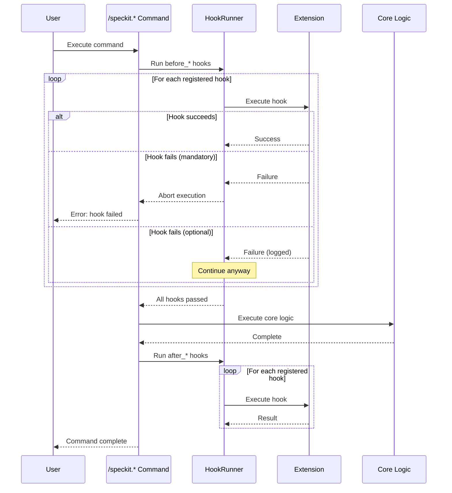

# Extension Hooks Architecture

This document explains the extension hooks system in specify-cli: why it exists, how it works, and practical examples for each hook point.

## Why Hooks?

The Spec-Driven Development workflow follows a predictable sequence: specify → plan → tasks → implement. But every team has unique needs:

- **Compliance teams** need security reviews before any code is written
- **Enterprise teams** need architecture approval gates
- **Open source projects** need contributor license checks
- **Regulated industries** need audit trails at every step

Rather than baking every possible requirement into the core commands, hooks let you **extend the workflow without modifying it**.

### The Plugin Philosophy

```
┌─────────────────────────────────────────────────────────────────┐
│                     CORE WORKFLOW (stable)                       │
│  specify → plan → tasks → implement                              │
└─────────────────────────────────────────────────────────────────┘
       ↑        ↑       ↑         ↑
       │        │       │         │
┌──────┴────────┴───────┴─────────┴──────┐
│           EXTENSION HOOKS               │
│  before_*  │  after_*  │  validators    │
│  (prepare) │ (react)   │  (gate)        │
└─────────────────────────────────────────┘
```

**Benefits:**

1. **Separation of concerns** — Core workflow stays simple; extensions handle domain-specific needs
2. **Composability** — Mix and match extensions for different project types
3. **Upgradability** — Update specify-cli without breaking your custom integrations
4. **Shareability** — Publish extensions as reusable packages for your organization

## Lifecycle State Diagram

```mermaid
stateDiagram-v2
    [*] --> Idle: Project initialized

    state "Specification Phase" as SpecPhase {
        [*] --> BeforeSpecify
        BeforeSpecify --> SpecifyRunning: hooks pass
        BeforeSpecify --> SpecifyBlocked: mandatory hook fails
        SpecifyRunning --> AfterSpecify: spec written
        AfterSpecify --> [*]: hooks complete
        SpecifyBlocked --> [*]: abort
    }

    state "Planning Phase" as PlanPhase {
        [*] --> BeforePlan
        BeforePlan --> PlanRunning: hooks pass
        BeforePlan --> PlanBlocked: mandatory hook fails
        PlanRunning --> AfterPlan: plan written
        AfterPlan --> [*]: hooks complete
        PlanBlocked --> [*]: abort
    }

    state "Task Phase" as TaskPhase {
        [*] --> BeforeTasks
        BeforeTasks --> TasksRunning: hooks pass
        TasksRunning --> AfterTasks: tasks written
        AfterTasks --> [*]: hooks complete
    }

    state "Implementation Phase" as ImplPhase {
        [*] --> BeforeImplement
        BeforeImplement --> ImplementRunning: hooks pass
        BeforeImplement --> ImplementBlocked: mandatory hook fails
        ImplementRunning --> AfterImplement: code complete
        AfterImplement --> [*]: hooks complete
        ImplementBlocked --> [*]: abort
    }

    Idle --> SpecPhase: /speckit.specify
    SpecPhase --> PlanPhase: /speckit.plan
    PlanPhase --> TaskPhase: /speckit.tasks
    TaskPhase --> ImplPhase: /speckit.implement
    ImplPhase --> [*]: Feature complete
```



## Hook Execution Flow



## Hook Types

### Before Hooks (Gates)

**Purpose:** Validate preconditions, gather context, or block execution if requirements aren't met.

| Hook | Fires When | Common Use Cases |
|------|------------|------------------|
| `before_specify` | Before spec generation | Load context from external systems, validate feature naming conventions |
| `before_plan` | Before planning starts | Check architecture constraints, load tech radar data |
| `before_tasks` | Before task breakdown | Validate resource availability, check sprint capacity |
| `before_implement` | Before coding starts | Verify environment setup, check branch protection rules |

### After Hooks (Reactions)

**Purpose:** React to completed work, trigger downstream processes, or notify stakeholders.

| Hook | Fires When | Common Use Cases |
|------|------------|------------------|
| `after_specify` | After spec is written | Send for review, update project tracker, run AI analysis |
| `after_plan` | After plan is complete | Trigger architecture review, estimate costs, notify team |
| `after_tasks` | After tasks generated | Create Jira issues, update roadmap, assign reviewers |
| `after_implement` | After implementation done | Run tests, deploy to staging, create PR |

## Configuration

Hooks are configured in `.specify/extensions.yml`:

```yaml
# Extension registry
extensions:
  security-scanner:
    version: "1.2.0"
    source: "@company/speckit-security"
  
  jira-sync:
    version: "2.0.0"
    source: "@company/speckit-jira"
  
  architecture-review:
    version: "1.0.0"
    source: "local:.specify/extensions/arch-review"

# Hook registrations
hooks:
  before_specify:
    - extension: security-scanner
      command: security.pre-scan
      description: Check for sensitive data patterns in feature description
      optional: true
      
  after_specify:
    - extension: security-scanner
      command: security.analyze-spec
      description: Analyze spec for security implications
      optional: false  # Mandatory - blocks if fails
      
  before_plan:
    - extension: architecture-review
      command: arch.check-constraints
      description: Validate against architecture decision records
      optional: false
      condition: "spec.tags contains 'infrastructure'"
      
  after_plan:
    - extension: jira-sync
      command: jira.create-epic
      description: Create Jira epic from plan
      optional: true
      
  after_tasks:
    - extension: jira-sync
      command: jira.create-subtasks
      description: Create Jira subtasks from tasks.md
      optional: true
      
  before_implement:
    - extension: security-scanner
      command: security.check-dependencies
      description: Scan planned dependencies for vulnerabilities
      optional: false
      
  after_implement:
    - extension: jira-sync
      command: jira.transition-done
      description: Move Jira issues to Done
      optional: true
```

## Real-World Extension Examples

### Example 1: Security Scanner Extension

**Problem:** Your security team requires threat modeling before any feature is implemented. Manual reviews create bottlenecks.

**Solution:** Automated security analysis at specification and planning phases.

```yaml
# .specify/extensions/security-scanner/manifest.yml
name: security-scanner
version: "1.2.0"
description: Automated security analysis for SDD workflow

commands:
  security.pre-scan:
    description: Quick scan of feature description for red flags
    script: scripts/pre-scan.sh
    
  security.analyze-spec:
    description: Deep analysis of specification for security implications
    script: scripts/analyze-spec.sh
    outputs:
      - threat-model.md
      - security-checklist.md
    
  security.check-dependencies:
    description: Scan planned dependencies for known vulnerabilities
    script: scripts/dep-scan.sh
    
hooks:
  after_specify:
    - command: security.analyze-spec
      optional: false
      
  before_implement:
    - command: security.check-dependencies
      optional: false
```

**Example command template** (`.specify/extensions/security-scanner/commands/security.analyze-spec.md`):

```markdown
---
description: Analyze specification for security implications and generate threat model
---

## Security Analysis

Analyze the current feature specification for security implications.

### Input
- Read `specs/{current}/spec.md`
- Read `.specify/memory/constitution.md` for security principles

### Analysis Steps

1. **Data Flow Analysis**
   - Identify all data inputs and outputs
   - Classify data sensitivity (PII, credentials, financial, etc.)
   - Map data storage and transmission paths

2. **Threat Modeling (STRIDE)**
   - Spoofing: Authentication requirements
   - Tampering: Data integrity controls
   - Repudiation: Audit logging needs
   - Information Disclosure: Encryption requirements
   - Denial of Service: Rate limiting, resource constraints
   - Elevation of Privilege: Authorization boundaries

3. **Compliance Check**
   - GDPR implications (if PII involved)
   - PCI-DSS requirements (if payment data)
   - HIPAA considerations (if health data)

### Output

Write to `specs/{current}/threat-model.md`:
- Identified threats with severity ratings
- Recommended mitigations
- Security requirements to add to spec

Write to `specs/{current}/checklists/security.md`:
- Pre-implementation security checklist
- Required security controls
- Testing requirements
```

---

### Example 2: Jira Integration Extension

**Problem:** Tasks in `tasks.md` need to be manually copied to Jira. This is error-prone and creates sync issues.

**Solution:** Automatic Jira issue creation from tasks, with bidirectional status sync.

```yaml
# .specify/extensions/jira-sync/manifest.yml
name: jira-sync
version: "2.0.0"
description: Bidirectional sync between SDD artifacts and Jira

config:
  jira_url: ${JIRA_URL}
  jira_project: ${JIRA_PROJECT}
  jira_api_token: ${JIRA_API_TOKEN}

commands:
  jira.create-epic:
    description: Create Jira epic from plan.md
    script: scripts/create-epic.ts
    
  jira.create-subtasks:
    description: Create Jira subtasks from tasks.md
    script: scripts/create-subtasks.ts
    
  jira.sync-status:
    description: Sync task completion status to Jira
    script: scripts/sync-status.ts
    
  jira.transition-done:
    description: Move completed tasks to Done in Jira
    script: scripts/transition-done.ts

hooks:
  after_plan:
    - command: jira.create-epic
      optional: true
      
  after_tasks:
    - command: jira.create-subtasks
      optional: true
      
  after_implement:
    - command: jira.transition-done
      optional: true
```

**Example sync script** (`scripts/create-subtasks.ts`):

```typescript
#!/usr/bin/env bun

import { readFileSync } from 'fs';
import { parse } from 'path';

interface Task {
  id: string;
  title: string;
  phase: string;
  estimate?: string;
  dependencies: string[];
}

function parseTasksMd(content: string): Task[] {
  const tasks: Task[] = [];
  let currentPhase = '';
  
  for (const line of content.split('\n')) {
    if (line.startsWith('## Phase')) {
      currentPhase = line.replace('## ', '');
    }
    if (line.match(/^### Task \d+\.\d+:/)) {
      const match = line.match(/### Task (\d+\.\d+): (.+)/);
      if (match) {
        tasks.push({
          id: match[1],
          title: match[2],
          phase: currentPhase,
          dependencies: [],
        });
      }
    }
  }
  
  return tasks;
}

async function createJiraSubtasks(tasks: Task[], epicKey: string) {
  const jiraUrl = process.env.JIRA_URL;
  const auth = Buffer.from(
    `${process.env.JIRA_EMAIL}:${process.env.JIRA_API_TOKEN}`
  ).toString('base64');
  
  for (const task of tasks) {
    const response = await fetch(`${jiraUrl}/rest/api/3/issue`, {
      method: 'POST',
      headers: {
        'Authorization': `Basic ${auth}`,
        'Content-Type': 'application/json',
      },
      body: JSON.stringify({
        fields: {
          project: { key: process.env.JIRA_PROJECT },
          parent: { key: epicKey },
          summary: `[${task.id}] ${task.title}`,
          issuetype: { name: 'Sub-task' },
          labels: ['sdd-generated', task.phase.toLowerCase().replace(/\s+/g, '-')],
        },
      }),
    });
    
    const result = await response.json();
    console.log(`Created: ${result.key} - ${task.title}`);
  }
}

// Main
const tasksContent = readFileSync('tasks.md', 'utf-8');
const epicKey = process.env.JIRA_EPIC_KEY || readFileSync('.jira-epic', 'utf-8').trim();
const tasks = parseTasksMd(tasksContent);

await createJiraSubtasks(tasks, epicKey);
```

---

### Example 3: Architecture Decision Records (ADR) Extension

**Problem:** Architecture decisions made during planning are lost or undocumented. Teams repeatedly debate the same decisions.

**Solution:** Automatically extract and formalize architectural decisions into ADRs.

```yaml
# .specify/extensions/adr-generator/manifest.yml
name: adr-generator
version: "1.0.0"
description: Generate Architecture Decision Records from planning artifacts

commands:
  adr.extract-decisions:
    description: Extract architectural decisions from research.md and plan.md
    template: commands/extract-decisions.md
    
  adr.check-constraints:
    description: Validate plan against existing ADRs
    template: commands/check-constraints.md
    
  adr.suggest-patterns:
    description: Suggest architectural patterns based on requirements
    template: commands/suggest-patterns.md

hooks:
  before_plan:
    - command: adr.suggest-patterns
      description: Suggest relevant architectural patterns
      optional: true
      
    - command: adr.check-constraints
      description: Ensure plan doesn't violate existing ADRs
      optional: false
      
  after_plan:
    - command: adr.extract-decisions
      description: Generate ADRs from planning decisions
      optional: true
```

**Example command template** (`commands/extract-decisions.md`):

```markdown
---
description: Extract architectural decisions from planning artifacts and generate ADRs
---

## ADR Extraction

Analyze planning documents to identify and formalize architectural decisions.

### Input Sources
- `specs/{current}/research.md` - Technical research and decisions
- `specs/{current}/plan.md` - Implementation plan
- `specs/{current}/data-model.md` - Data architecture decisions

### Decision Identification

Look for:
1. **Technology choices** - "We chose X over Y because..."
2. **Pattern selections** - "Using the repository pattern for..."
3. **Trade-off resolutions** - "Accepting eventual consistency to gain..."
4. **Constraint acknowledgments** - "Due to legacy system limitations..."

### ADR Template

For each identified decision, create `docs/adr/ADR-{NNN}-{title}.md`:

```markdown
# ADR-{NNN}: {Title}

## Status
Accepted

## Context
{What is the issue that we're seeing that is motivating this decision?}

## Decision
{What is the change that we're proposing and/or doing?}

## Consequences
{What becomes easier or more difficult because of this decision?}

## Alternatives Considered
{What other options were evaluated?}

## Related
- Feature: specs/{current}/spec.md
- Plan: specs/{current}/plan.md
```

### Output
- Write ADR files to `docs/adr/`
- Update `docs/adr/README.md` with index
- Add references to original planning docs
```

---

### Example 4: Cost Estimation Extension

**Problem:** Features get planned without understanding infrastructure or operational costs. Budget surprises occur late in development.

**Solution:** Automated cost estimation based on the technical plan.

```yaml
# .specify/extensions/cost-estimator/manifest.yml
name: cost-estimator
version: "1.0.0"
description: Estimate infrastructure and operational costs from plans

config:
  cloud_provider: aws  # aws | gcp | azure
  pricing_api_key: ${CLOUD_PRICING_API_KEY}

commands:
  cost.estimate-infrastructure:
    description: Estimate cloud infrastructure costs
    template: commands/estimate-infra.md
    
  cost.estimate-operations:
    description: Estimate ongoing operational costs
    template: commands/estimate-ops.md

hooks:
  after_plan:
    - command: cost.estimate-infrastructure
      description: Generate cost estimate for planned infrastructure
      optional: true
```

**Example output** (`specs/{current}/cost-estimate.md`):

```markdown
# Cost Estimate: User Authentication Feature

## Infrastructure Costs (Monthly)

| Resource | Specification | Estimated Cost |
|----------|--------------|----------------|
| RDS PostgreSQL | db.t3.medium, 100GB | $65.00 |
| ElastiCache Redis | cache.t3.micro | $12.50 |
| Lambda Functions | 1M requests/mo | $0.20 |
| API Gateway | 1M requests/mo | $3.50 |
| S3 Storage | 10GB | $0.23 |
| CloudWatch Logs | 5GB/mo | $2.50 |
| **Total Infrastructure** | | **$83.93/mo** |

## Operational Costs (Monthly)

| Category | Description | Estimated Cost |
|----------|-------------|----------------|
| Monitoring | DataDog APM (2 hosts) | $46.00 |
| Secrets Management | AWS Secrets Manager (5 secrets) | $2.00 |
| SSL Certificates | ACM (free) | $0.00 |
| **Total Operations** | | **$48.00/mo** |

## First Year Total

- Setup costs: ~$500 (engineering time)
- Monthly recurring: $131.93
- **Annual estimate: $2,083.16**

## Cost Optimization Recommendations

1. Use Reserved Instances for RDS (-40% = $26/mo savings)
2. Consider Aurora Serverless for variable load patterns
3. Implement CloudWatch log retention policies (7 days vs 30)
```

---

### Example 5: Compliance Checker Extension

**Problem:** Regulated industries (healthcare, finance) need compliance verification at every step. Manual compliance reviews slow down development.

**Solution:** Automated compliance checking against regulatory requirements.

```yaml
# .specify/extensions/compliance-checker/manifest.yml
name: compliance-checker
version: "1.0.0"
description: Automated compliance verification for regulated industries

config:
  frameworks:
    - hipaa
    - soc2
    - gdpr

commands:
  compliance.check-spec:
    description: Verify specification meets compliance requirements
    template: commands/check-spec.md
    
  compliance.check-plan:
    description: Verify technical plan meets compliance requirements
    template: commands/check-plan.md
    
  compliance.generate-evidence:
    description: Generate compliance evidence documentation
    template: commands/generate-evidence.md

hooks:
  after_specify:
    - command: compliance.check-spec
      description: Verify spec meets regulatory requirements
      optional: false
      
  after_plan:
    - command: compliance.check-plan
      description: Verify plan includes required controls
      optional: false
      
  after_implement:
    - command: compliance.generate-evidence
      description: Generate compliance evidence for audit
      optional: false
```

**Example compliance report** (`specs/{current}/compliance-report.md`):

```markdown
# Compliance Report: User Authentication Feature

## HIPAA Compliance

| Requirement | Status | Evidence |
|-------------|--------|----------|
| Access Controls (§164.312(a)(1)) | PASS | Spec includes role-based access |
| Audit Controls (§164.312(b)) | PASS | Plan includes audit logging |
| Integrity Controls (§164.312(c)(1)) | PASS | Data validation in spec |
| Transmission Security (§164.312(e)(1)) | PASS | TLS 1.3 required in plan |
| Authentication (§164.312(d)) | PASS | MFA specified in requirements |

## SOC 2 Type II

| Trust Principle | Control | Status |
|-----------------|---------|--------|
| Security | CC6.1 - Logical access | PASS |
| Availability | CC7.1 - System monitoring | PENDING |
| Confidentiality | CC6.7 - Data encryption | PASS |

## Required Actions

1. **CC7.1**: Add monitoring requirements to spec
   - Uptime SLA definition needed
   - Alerting thresholds required

## Compliance Sign-off

- [ ] Security Team Review
- [ ] Compliance Officer Approval
- [ ] Legal Review (if PII involved)
```

---

## Creating Your Own Extension

### Directory Structure

```
.specify/extensions/my-extension/
├── manifest.yml           # Extension metadata and hook registrations
├── commands/              # Command templates (markdown)
│   ├── my-command.md
│   └── another-command.md
├── scripts/               # Executable scripts
│   ├── run-analysis.sh
│   └── generate-report.ts
└── templates/             # Output templates
    └── report-template.md
```

### Manifest Schema

```yaml
# manifest.yml
name: my-extension
version: "1.0.0"
description: What this extension does
author: Your Name <email@example.com>
license: MIT

# Required configuration
config:
  api_key:
    description: API key for external service
    required: true
    env: MY_API_KEY
  
  threshold:
    description: Analysis threshold
    required: false
    default: 0.8

# Commands provided by this extension
commands:
  my-extension.analyze:
    description: Analyze the specification
    template: commands/analyze.md
    
  my-extension.report:
    description: Generate analysis report
    script: scripts/generate-report.ts

# Hook registrations
hooks:
  after_specify:
    - command: my-extension.analyze
      optional: true
      condition: "spec.tags contains 'needs-analysis'"
```

### Hook Conditions

Conditions allow hooks to run only when certain criteria are met:

```yaml
hooks:
  after_specify:
    - command: security.deep-scan
      condition: "spec.tags contains 'security-critical'"
      
    - command: perf.baseline
      condition: "spec.requirements.performance != null"
      
  before_implement:
    - command: arch.review
      condition: "plan.changes_database == true"
```

## Best Practices

### 1. Make hooks idempotent

Hooks may run multiple times (retries, re-runs). Ensure they produce the same result:

```typescript
// Good: Check before creating
if (!await jiraIssueExists(taskId)) {
  await createJiraIssue(task);
}

// Bad: Always create (duplicates on retry)
await createJiraIssue(task);
```

### 2. Fail fast for mandatory hooks

If a mandatory hook can't complete, fail immediately with a clear message:

```typescript
if (!process.env.JIRA_API_TOKEN) {
  console.error('ERROR: JIRA_API_TOKEN environment variable not set');
  console.error('Set it with: export JIRA_API_TOKEN=your-token');
  process.exit(1);
}
```

### 3. Provide actionable error messages

```typescript
// Good
throw new Error(
  `Security scan failed: Found 3 high-severity vulnerabilities\n` +
  `Run 'npm audit' for details\n` +
  `To bypass (not recommended): set SKIP_SECURITY_SCAN=true`
);

// Bad
throw new Error('Security check failed');
```

### 4. Log progress for long-running hooks

```typescript
console.log('Analyzing specification...');
const threats = await analyzeThreats(spec);
console.log(`Found ${threats.length} potential threats`);

console.log('Generating threat model...');
await generateThreatModel(threats);
console.log('Threat model written to threat-model.md');
```

### 5. Make optional hooks truly optional

Optional hooks should enhance the workflow, not be silently required:

```yaml
# Good: Clear about what happens if skipped
hooks:
  after_tasks:
    - command: jira.create-subtasks
      description: Create Jira subtasks (skip if not using Jira)
      optional: true

# Bad: Marked optional but workflow breaks without it
hooks:
  after_tasks:
    - command: required-step.run
      description: Critical validation
      optional: true  # This should be optional: false!
```

## Debugging Hooks

### Verbose mode

```bash
SPECKIT_DEBUG=hooks specify init my-project --ai claude
```

### Hook execution log

Check `.specify/logs/hooks.log` for execution history:

```
2024-01-15T10:30:00Z [before_specify] security.pre-scan - STARTED
2024-01-15T10:30:02Z [before_specify] security.pre-scan - SUCCESS (2.1s)
2024-01-15T10:30:02Z [before_specify] context.load-external - STARTED
2024-01-15T10:30:05Z [before_specify] context.load-external - SUCCESS (3.2s)
2024-01-15T10:35:00Z [after_specify] security.analyze-spec - STARTED
2024-01-15T10:35:15Z [after_specify] security.analyze-spec - SUCCESS (15.0s)
```

### Dry run

Test hooks without executing the full command:

```bash
specify hooks test before_specify --dry-run
```
