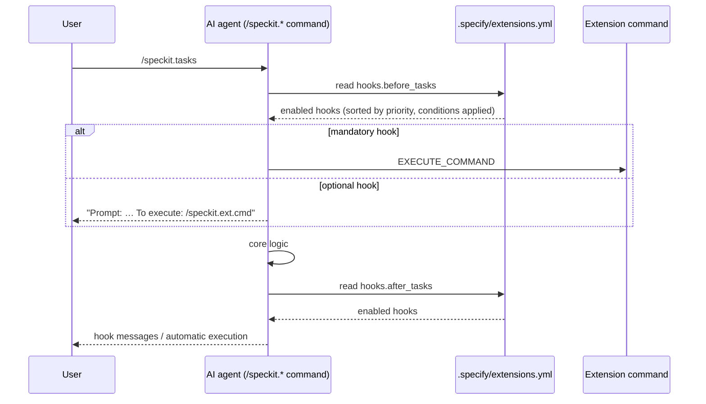

# Extension Hooks Architecture

This document explains the extension hooks system in specify-cli: why it
exists, how it works, and how to declare hooks in an extension. It tracks the
semantics of upstream spec-kit v1.0.12 (`specify_cli/extensions`), which this
package ports 1:1 in `src/extensions/`.

## Why Hooks?

The Spec-Driven Development workflow follows a predictable sequence:
specify → plan → tasks → implement. But every team has unique needs:

- **Compliance teams** need security reviews before any code is written
- **Enterprise teams** need architecture approval gates
- **Open source projects** need contributor license checks
- **Regulated industries** need audit trails at every step

Rather than baking every possible requirement into the core commands, hooks let
you **extend the workflow without modifying it**.

### The Plugin Philosophy

```
┌─────────────────────────────────────────────────────────────────┐
│                     CORE WORKFLOW (stable)                       │
│  specify → plan → tasks → implement                              │
└─────────────────────────────────────────────────────────────────┘
       ↑        ↑       ↑         ↑
       │        │       │         │
┌──────┴────────┴───────┴─────────┴──────┐
│           EXTENSION HOOKS               │
│      before_*        │     after_*      │
│      (prepare/gate)  │     (react)      │
└─────────────────────────────────────────┘
```

**Benefits:**

1. **Separation of concerns** — Core workflow stays simple; extensions handle domain-specific needs
2. **Composability** — Mix and match extensions for different project types
3. **Upgradability** — Update specify-cli without breaking your custom integrations
4. **Shareability** — Publish extensions as reusable packages for your organization

## How Hooks Execute

Hooks are **not** run by the CLI. Core command templates (the
`/speckit.*` prompts installed into your agent) contain a hook-check step that
reads `.specify/extensions.yml` for the relevant event. The AI agent then:

- for an **optional** hook (`optional: true`, the default): shows the hook's
  prompt and the command to run, and lets the user decide;
- for a **mandatory** hook (`optional: false`): runs the command automatically
  (`EXECUTE_COMMAND:` instruction).


```mermaid
sequenceDiagram
    participant User
    participant Agent as AI agent (/speckit.* command)
    participant Config as .specify/extensions.yml
    participant Ext as Extension command

    User->>Agent: /speckit.tasks
    Agent->>Config: read hooks.before_tasks
    Config-->>Agent: enabled hooks (sorted by priority, conditions applied)
    alt mandatory hook
        Agent->>Ext: EXECUTE_COMMAND
    else optional hook
        Agent-->>User: "Prompt: …  To execute: /speckit.ext.cmd"
    end
    Agent->>Agent: core logic
    Agent->>Config: read hooks.after_tasks
    Config-->>Agent: enabled hooks
    Agent-->>User: hook messages / automatic execution
```

`HookExecutor` (in `src/extensions/hooks.ts`) is the programmatic view of the
same data: it registers/unregisters hooks, filters and orders them, evaluates
conditions, and renders the agent-facing message.

## Hook Events

Standard events (defined by core command templates):

| Event | Fires |
|-------|-------|
| `before_specify` / `after_specify` | around specification generation |
| `before_plan` / `after_plan` | around implementation planning |
| `before_tasks` / `after_tasks` | around task generation |
| `before_implement` / `after_implement` | around implementation |
| `before_analyze` / `after_analyze` | around cross-artifact analysis |
| `before_checklist` / `after_checklist` | around checklist generation |
| `before_clarify` / `after_clarify` | around spec clarification |
| `before_constitution` / `after_constitution` | around constitution updates |
| `before_taskstoissues` / `after_taskstoissues` | around tasks-to-issues conversion |

(Native agent *events* such as `session_start` or `pre_tool_use` are a
separate mechanism declared under the top-level `events:` key of
`extension.yml`; see the events documentation.)

## Declaring Hooks (`extension.yml`)

Each event accepts either a single hook mapping or a list of mappings. A list
registers multiple commands on the same event.

```yaml
schema_version: "1.0"

extension:
  id: jira
  name: Jira Integration
  version: 1.0.0
  description: Create Jira issues from tasks
  author: Your Team

requires:
  speckit_version: ">=0.1.0"

provides:
  commands:
    - name: speckit.jira.specstoissues
      file: commands/specstoissues.md
      description: Create Jira issues from tasks.md

hooks:
  # Single mapping
  after_tasks:
    command: speckit.jira.specstoissues
    optional: true
    prompt: "Create Jira issues from tasks?"
    description: Automatically create the Jira hierarchy

  # List of mappings with explicit priorities
  after_plan:
    - command: speckit.jira.verify
      priority: 5
      optional: false
      description: Verify the plan
    - command: speckit.jira.report
      priority: 10
      prompt: "Generate the report?"
```

Hook fields:

| Field | Type | Default | Notes |
|-------|------|---------|-------|
| `command` | string | — | Required. Short forms `jira.verify` / `speckit.verify` are canonicalized to `speckit.jira.verify` (with a warning). |
| `optional` | boolean | `true` | `false` = automatic (mandatory) hook. |
| `priority` | integer ≥ 1 | `10` | Lower runs first; ties keep authoring order (stable sort). Booleans and non-integers are rejected. |
| `prompt` | string | `Execute {command}?` | Shown for optional hooks. |
| `description` | string | `""` | |
| `condition` | string | `null` | See [Hook Conditions](#hook-conditions). |

Validation rules (`ExtensionManifest`):

- `hooks` must be a mapping; each event is a mapping or a non-empty list of mappings.
- Each entry needs a `command`.
- Within one manifest list, a repeated `command` is deduped as "last wins" and
  moved to the end.
- An extension may consist of hooks only (no commands).

## Registered Configuration (`.specify/extensions.yml`)

`specify extension add` / `remove` / `enable` / `disable` maintain this file
(written with PyYAML-compatible block style, keys in insertion order):

```yaml
installed:
- jira
settings:
  auto_execute_hooks: true
hooks:
  after_tasks:
  - extension: jira
    command: speckit.jira.specstoissues
    enabled: true
    optional: true
    priority: 10
    prompt: Create Jira issues from tasks?
    description: Automatically create the Jira hierarchy
    condition: null
```

Behavior on (re)install:

- The extension is added to `installed` (sorted, de-duplicated, invalid IDs dropped).
- All of the extension's previous entries are purged and re-added, so a changed
  shape (list ↔ single mapping, shorter list, dropped event) leaves no orphans.
- Other extensions' entries are preserved; empty event lists are removed.
- Corrupted content (non-list events, non-mapping entries) is normalized.

`specify extension disable <id>` sets `enabled: false` on every hook of the
extension (and `enable` sets it back); disabled hooks are ignored.

## Hook Message Format

For an optional hook:

```markdown
## Extension Hooks

Hooks available for event 'after_tasks':


**Optional Hook**: jira
Command: `/speckit.jira.specstoissues`
Description: Automatically create the Jira hierarchy

Prompt: Create Jira issues from tasks?
To execute: `/speckit.jira.specstoissues`
```

For a mandatory hook:

```markdown
**Automatic Hook**: jira
Executing: `/speckit.jira.verify`
EXECUTE_COMMAND: speckit.jira.verify
EXECUTE_COMMAND_INVOCATION: /speckit.jira.verify
```

The invocation is rendered for the active agent recorded in
`.specify/init-options.json`:

| Agent / mode | `speckit.jira.verify` renders as |
|--------------|----------------------------------|
| default | `/speckit.jira.verify` |
| skills-mode slash agents (e.g. Claude with `ai_skills: true`) | `/speckit-jira-verify` |
| Codex / ZCode / Command Code in skills mode | `$speckit-jira-verify` |
| Kimi | `/skill:speckit-jira-verify` |
| Cline / Forge / Junie | `/speckit-jira-verify` |

## Hook Conditions

A hook runs only when its `condition` (if any) evaluates to true. Supported
expressions (case-insensitive keywords):

| Expression | Meaning |
|------------|---------|
| `config.key.path is set` | the extension's merged config contains the key |
| `config.key.path == 'value'` | config value equals `value` (booleans compare as `true`/`false`) |
| `config.key.path != 'value'` | config value differs from `value` |
| `env.VAR_NAME is set` | the environment variable exists |
| `env.VAR_NAME == 'value'` / `!= 'value'` | environment variable comparison |

Any other expression — or an evaluation error — evaluates to **false** (the
hook is skipped).

### Extension configuration layers

`config.*` conditions read the extension's merged configuration
(`ConfigManager`), lowest to highest precedence:

1. `config.defaults` in the extension's `extension.yml`
2. `.specify/extensions/<id>/<id>-config.yml`
3. `.specify/extensions/<id>/local-config.yml` (machine-local, gitignored)
4. Environment variables `SPECKIT_<EXT_ID>_<SECTION>_<KEY>` (e.g.
   `SPECKIT_JIRA_CONNECTION_URL` → `connection.url`)

Non-mapping YAML documents or sections are treated as empty. When two installed
extensions' prefixes collide (e.g. `git` and `git-hooks`), a variable such as
`SPECKIT_GIT_HOOKS_URL` belongs to the longer, more specific extension ID.

## Programmatic API

```typescript
import { HookExecutor } from './extensions/index.js'; // src/extensions

const hooks = new HookExecutor(projectRoot);
hooks.registerHooks(manifest);                 // add/refresh an extension's hooks
hooks.unregisterHooks('jira');                 // remove them
hooks.getHooksForEvent('after_tasks');         // enabled hooks, priority-ordered
hooks.shouldExecuteHook(hook);                 // condition evaluation
hooks.checkHooksForEvent('after_tasks');       // { has_hooks, hooks, message }
hooks.formatHookMessage('after_tasks', list);  // agent-facing markdown
hooks.executeHook(hook);                       // { command, invocation, extension, optional, description, prompt }
hooks.enableHooks('jira'); hooks.disableHooks('jira');
```

## Best Practices

1. **Make hook commands idempotent.** Hooks may run multiple times (retries, re-runs).
2. **Use `optional: false` sparingly.** Automatic hooks run without asking; reserve them for true gates.
3. **Write actionable prompts.** The prompt is all the user sees before deciding.
4. **Guard environment-dependent hooks with conditions**, e.g. `condition: "env.JIRA_API_TOKEN is set"`.
5. **Use priorities to order related hooks** instead of relying on install order.
